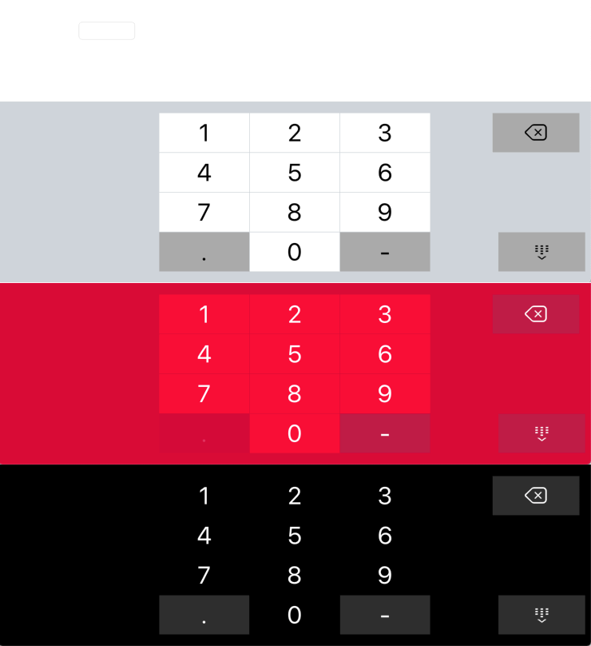
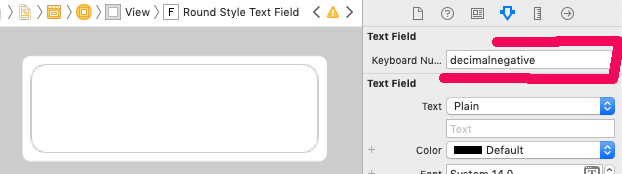
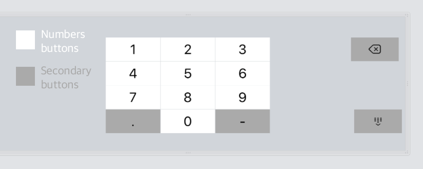

# SimpleSwiftNumericKeyboard

[](https://travis-ci.org/mmachado53/SimpleSwiftNumericKeyboard)
[](https://cocoapods.org/pods/SimpleSwiftNumericKeyboard)
[](https://cocoapods.org/pods/SimpleSwiftNumericKeyboard)
[](https://cocoapods.org/pods/SimpleSwiftNumericKeyboard)

Its a simple numeric keyboard for iPad.



## Example

To run the example project, clone the repo, and run `pod install` from the Example directory first.

## Requirements

## Installation

SimpleSwiftNumericKeyboard is available through [CocoaPods](https://cocoapods.org). To install
it, simply add the following line to your Podfile:

```ruby
pod 'SimpleSwiftNumericKeyboard'
```

## Author

mmachado53, mmachado53@gmail.com

## Usage in storyboard

Set value in keyboardNumericType inspectable var, can be:
 - ####"numeric"            
        disable "." and "-" keys
 - ####"decimal"           
        enable "." key disable "-" key
 - ####"decimalnegative"    
            enable "." and "-" keys
 - ####"numericnegative"    
            disable "." key enable "-" key
 


## Usage in code
Just use "NumericKeyBoard.set" function
``` swift
import SimpleSwiftNumericKeyboard

override func viewDidLoad() {
        super.viewDidLoad()
        // type can be: .decimalPad .decimalNegativePad .numberPad .numberNegativePad
        NumericKeyBoard.set(uiTextFieldInstance, type: .numberPad) 
        
    }
```

## Customize colors

There are basically two types of buttons, "Numbers buttons" and "Secondary buttons" 


### Global colors customization

It has to be configured in the AppDelegate
``` swift
// AppDelegate.swift

import SimpleSwiftNumericKeyboard

func application(_ application: UIApplication, didFinishLaunchingWithOptions launchOptions: [UIApplicationLaunchOptionsKey: Any]?) -> Bool {
    
    
    /* 
        NumericKeyBoard.GLOBAL_COLOR_PALETTE is a [NumericKeyBoardColorPaletteProp : UIColor]
    */
    
    // Color of background 
    NumericKeyBoard.GLOBAL_COLOR_PALETTE[.backgroundColor] = UIColor.black
    
    // Color of numbers buttons 
    NumericKeyBoard.GLOBAL_COLOR_PALETTE[.stateNormalNumberButton] = UIColor.black
    
    // Color of number buttons when is pressed
    NumericKeyBoard.GLOBAL_COLOR_PALETTE[.statePressNumerButton] = UIColor.white.withAlphaComponent(0.3)
   
    // Color of text in numbers buttons
    NumericKeyBoard.GLOBAL_COLOR_PALETTE[.textColorNumberButton] = UIColor.white
   
    // Color of secondary buttons     
    NumericKeyBoard.GLOBAL_COLOR_PALETTE[.stateNormalSecondaryButton] = UIColor(red: 0.18, green: 0.18, blue: 0.18, alpha: 1)
   
    // Color of secondary buttons when is pressed
    NumericKeyBoard.GLOBAL_COLOR_PALETTE[.statePressSecondaryButton] = UIColor.white.withAlphaComponent(0.3)
   
    // Color of text in secondary buttons      
    NumericKeyBoard.GLOBAL_COLOR_PALETTE[.textColorSecondaryButton] = UIColor.white
    
    return true
}
```

### Colors customization in a specific UiTextField

``` swift
import SimpleSwiftNumericKeyboard

override func viewDidLoad() {
        super.viewDidLoad()
        
        var redStyle:[NumericKeyBoardColorPaletteProp:UIColor] = [:]
        redStyle[.backgroundColor] = UIColor(red: 0.85, green: 0, blue: 0.21, alpha: 1.0)
        redStyle[.stateNormalNumberButton] = UIColor(red: 1.0, green: 0, blue: 0.21, alpha: 1.0)
        redStyle[.statePressNumerButton] = UIColor.white.withAlphaComponent(0.3)
        redStyle[.textColorNumberButton] = UIColor.white
        redStyle[.stateNormalSecondaryButton] = UIColor(red: 0.75, green: 28 / 255, blue: 70 / 255, alpha: 1.0)
        redStyle[.statePressSecondaryButton] = UIColor.white.withAlphaComponent(0.3)
        redStyle[.textColorSecondaryButton] = UIColor.white
        // type can be: .decimalPad .decimalNegativePad .numberPad .numberNegativePad
        NumericKeyBoard.set(tf, type: .numberNegativePad,customPalette: redStyle)
        
    }
```


## License

SimpleSwiftNumericKeyboard is available under the MIT license. See the LICENSE file for more info.
